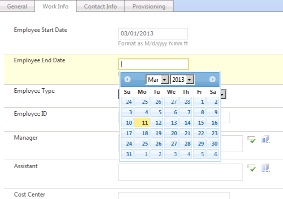
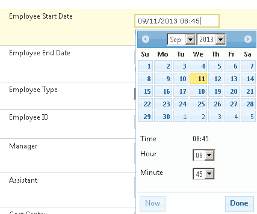

# FIMCalendar

One of the most annoying "features" of MS FIM portal is that you can't just pick a date from calendar, but you need to type it into date field (according to regional settings). 
This might be ok for nerds from IT department. But hey, you're going to make all other people use it, do you really think they want to type dates?

So the project goal is to add familiar jQuery datepicker to the FIM portal. Do you like it?



Added support for datetime as well. Thanks to the plugin at http://trentrichardson.com/examples/timepicker/



## Requirements

* WSS 3.0, SharePoint 2007, SharePoint 2010, or SharePoint 2013
* Forefront Identity Management 2010 (or 2010 R2) Portal or Microsoft Identity Manager 2016
* Works with existing RCDCs (no changes required)

## jQuery version

The project is built with jQuery 1.11.3 and custom jQuery UI 1.11.4 (with core and datepicker modules only). Client-side code is located under `12/TEMPLATE/LAYOUT/FIMCalendar`.

## Regional settings

Calendar doesn't have any special settings. It takes locale information from FIM portal, and localizes jQuery datepicker with corresponding locale information.

## Build instructions

There's already a pre-built version as a [WSP file](FIMCalendar.wsp). You may need to 'unblock' the file after downloading it by right clicking on it, selecting Properties and clicking the unblock button if it is visible.

If you want, you may build it from sources. You'll need Microsoft.SharePoint.dll (not included, you may copy it from your SP server), Visual Studio (2010 or later) and [WSPBuilder](http://wspbuilder.codeplex.com).

Build a solution in Visual Studio, after that launch WSPBuilder.exe in the solution directory. For example, if you forked a repositary to `C:\Projects\FIMCalendar`, you'll do the following:
```
c:\>cd C:\Projects\FIMCalendar
c:\Projects\FIMCalendar>"c:\Program Files (x86)\WSPTools\WSPBuilderExtensions\WSPBuilder.exe"
```

It will create or update a FIMCalendar.wsp in the solution folder. After that you're ready for installation

## Installation
You can use either stsadm, or the new PowerShell module
### stsadmin
First, you need to add a solution:
```
stsadm -o addsolution -filename c:\Projects\FIMCalendar\FIMCalendar.wsp
```

This will add solution named `FIMCalendar.wsp` to your SharePoint. After that you need to deploy it on IdentityManagement site (assuming `fim` is your server name):
```
stsadm -o deploysolution -name FIMCalendar.wsp -url http://fim/IdentityManangement/ -immediate -allowgacdeployment
```

After that you need to activate feature `FIMCalendar` for FIM Portal:
```
stsadm -o activatefeature -name FIMCalendar -url http://fim/IdentityManangement/
```

The feature has a single site scope, so it won't affect any other sites running on your SharePoint.

To update already deployed solution, you may use the following:
```
stsadm -o upgradesolution -name FIMCalendar.wsp -filename c:\Projects\FIMCalendar\FIMCalendar.wsp -immediate -allowgacdeployment
```
### Sharepoint Management PowerShell 
To install using the SharePoint Management PowerShell modules
```
Add-SPSolution -LiteralPath "D:\Source\FIMCalendar\FIMCalendar.wsp"
Install-SPSolution -Identity fimcalendar.wsp -WebApplication "http://mimportal.my.domain" -Force -GACDeployment -FullTrustBinDeployment
Enable-SPFeature -Identity FIMCalendar -Url "http://mimportal.my.domain/IdentityManagement"
iisreset
```
To update an existing installation
```
Update-SPSolution -Identity FIMCalendar -LiteralPath "D:\Source\FIMCalendar\FIMCalendar.wsp" -GACDeployment
```
